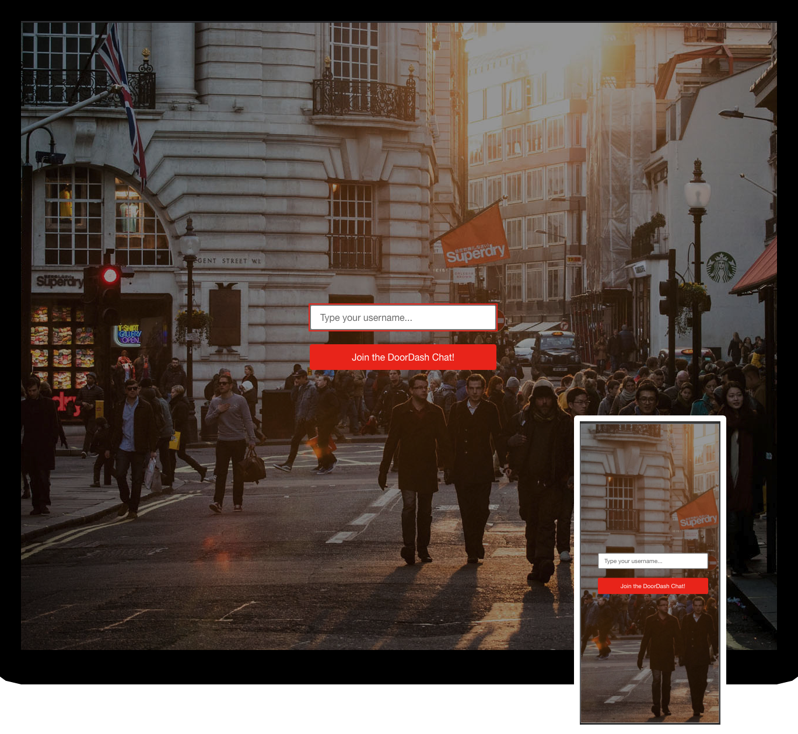
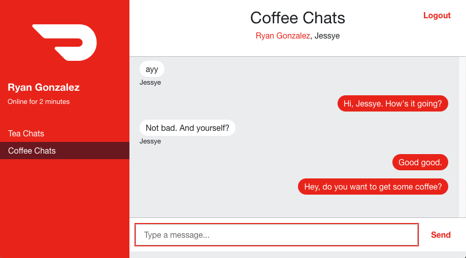
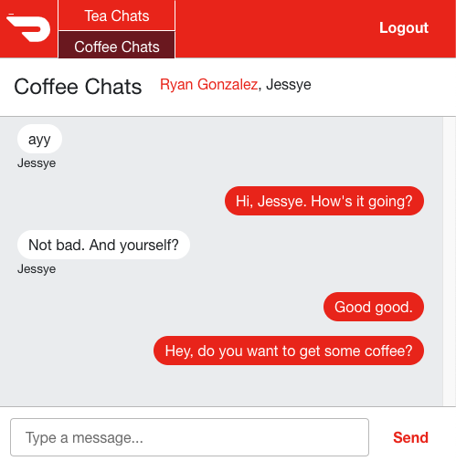
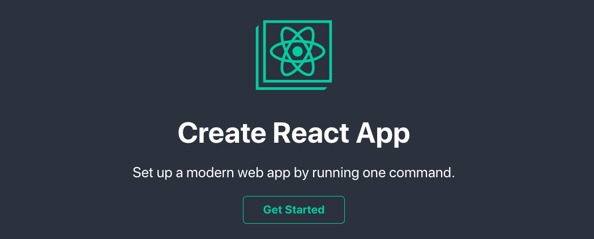
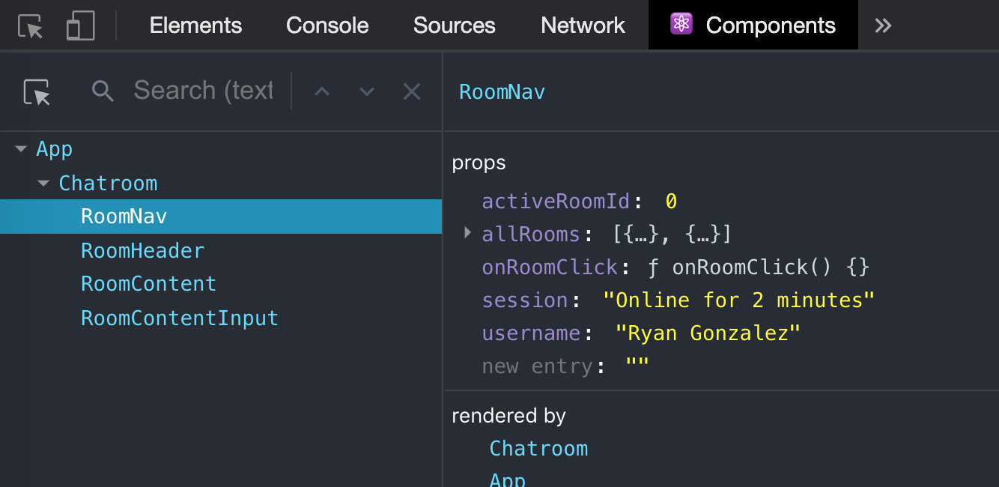
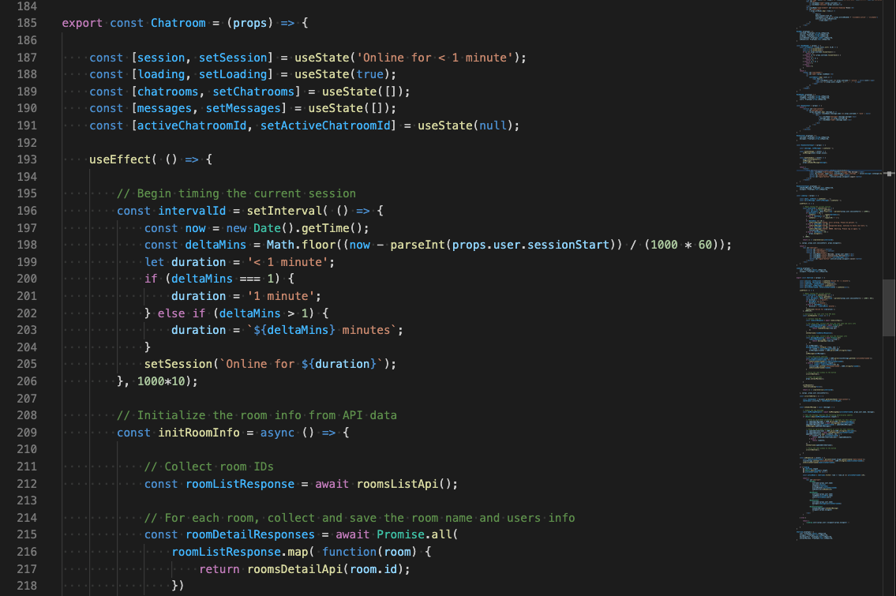
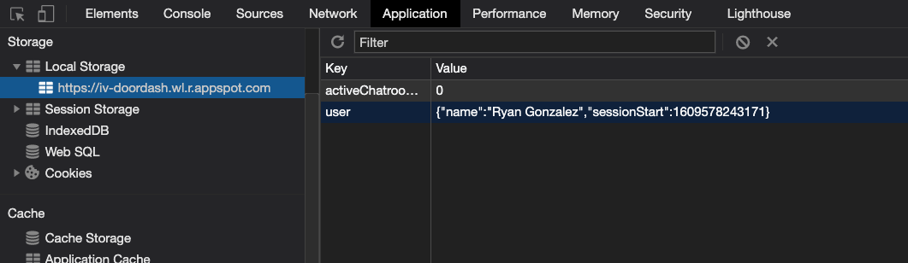
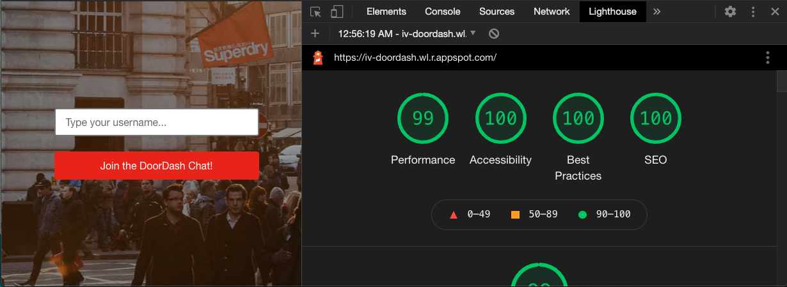

# DoorDash Frontend Interview Project

THIS is **DoorDash Chat ("DD-Chat")**. It's the app that lets you communicate in real-time with anyone else who has an Internet connection. Of course, there is no such thing as having too many chat apps. So here is how to get started...

## Connecting to the Locally Running App

### System and browser requirements
* [Node](https://nodejs.org/en/download/]) 7.0.0 or later.
* Chrome, Firefox, or Safari browsers at their current versions.

### Installation and startup
First, from [this GitHub repo](https://github.com/roderickwoodman/iv-doordash) click on the *"Code" button* and then select the *"Download ZIP" menu option* and save the file to your local drive.

Now, in the first terminal window, type:

	> cd <the download folder that contains the ZIP file>
	> unzip iv-doordash-main.zip
	> cd iv-doordash-main
	> npm install
	> npm run api-server

And in a second terminal window, type:

	> cd <the extracted iv-doordash-main folder> 
	> npm run client

### Viewing in the browser
Your second terminal window should now be showing the output:
><pre>Compiled successfully!
>You can now view iv-doordash-FE in the browser.
>Local:            http://localhost:8844</pre>
Finally, point your browser to  http://localhost:8844 to see the **DD-Chat** app!

### Confirming a server connection
When running locally (but not on the Internet deployment), please open your browser's console to confirm that the websocket connection to the server is up. This will enable new chat messages from one client connection to be pushed to all others, so that the browser does not have to be manually refreshed every time another client posts a new message to the chatroom. You should see something like this on the console when the app initially loads:
>Connected to the server as part of 3 total clients. [http://localhost:8080]

## OR, Connecting to the App LIVE on the Internet!
 
### Browser requirements
* Chrome, Firefox, or Safari browsers at their current versions.

### Viewing in the browser
Simply point your browser to  https://iv-doordash.wl.r.appspot.com/ to see the **DD-Chat** app!

## UI Views

The **login screen** is a simple username input field and a submit button. The background image communicates the mood of being mobile and socially connected. After passing the client-side string validation, the user is taken to the chatroom view.

  

  <em>Figure 1 - Login view</em>

The **chatroom view** is the primary interface for the user. It has simple color scheme and a session timer and a nav which switches between chatrooms.

  

  <em>Figure 2 - Chatroom view</em>

The **chatroom view on narrow screens** looks similar to the wide version. However, certain information was hidden in order to make room to fit all of the nav.

  

  <em>Figure 3 - Chatroom view on a narrow screen</em>

## Under The Hood

### Technology selections
**ReactJS** was the chosen JavaScript library for its ease of use and simple state and lifecycle management via Hooks. **Create-react-app** was used in order to quickly bootstrap the project. **Bootstrap** was added to have some generally accepted defaults for otherwise tricky design opinions like element padding. **Google Cloud Platform** was chosen as the Node-based deployment platform primarily to be a learning experience for the developer.

  

  <em>Figure 4 - create-react-app</em>

### Macro code structure
A modern, **component-based architecture** is essential for maintainability and extensibility. And because this application had a one-directional user flow in addition to a very limited data flow between only 2 views, it made sense to have the two views be more presentational style components ("Login" and "Chatroom") that were children under a more container-like, parent component ("App"). With this definition, not much data would need to be shared between these **3 primary components**, producing minimal coupling.

  

  <em>Figure 5 - Component architecture</em>

### Micro code structure
**Functional components** and **React Hooks** were used throughout the project, to eliminate the constructor boilerplate and "this" keyword referencing that would have been needed by class components. **Stateless components** were used wherever possible to improve maintainability. **SetInterval() timers** were used for managing Login delays and session time.  **Many ES6 features** like arrow functions, template literals, let and const, and promises (**async/await**) made coding easier and more readable. Both **CSS Grid** and **CSS Flexbox** were used to produce a responsive layout that had both fixed and expansive regions. And a **CSS Media Queries** breakpoint provided a second Grid layout for small screens that would still resemble the larger version.

  

  <em>Figure 6 - Component implementation</em>

### Usability
Many smaller design choices were made for **accessibility**, like an intentioned focus-tabbing as well as using < label > on all inputs and semantic tags like < nav>. **Affordances** were added to things like button hover states. And common **session management features** like login form validation, app loading timeout, and a logout link in the design help to make the user feel connected with the app through session feedback and (limited) user control. **Persistent storage of user state**, specifically of the username and the active chatroom, prevented information loss due to browser refreshes. In addition, **a websocket connection** prevented the user from needing to refresh the page manually anytime another client posted a new chat message. And finally, **relative CSS dimensions** like "rem" and "vh" were used everywhere so that when the user scales the font size for instance, the dimensions of the container elements scale too so that the proportions between the text and the shapes are maintained.

  

  <em>Figure 7 - Persistent user state</em>

### Testing
While there weren't any automated tests, **manual functional tests** were performed on the Chrome, Firefox, and Safari browsers and on different iOS and Android mobile devices. For component integration, the **PropTypes library** was attached to every component with props and would always do type checking. And **ESLint** was always checking my coding as I typed away in my IDE. But the one holistic test suite that was run was the **Lighthouse Chrome DevTool**.

  

  <em>Figure 8 - Lighthouse report for desktop</em>

## Summary and Reflection

### Extras!

The following features were not required, but were added anyways because they make a better product overall:
* **small-sized features:** custom favicon, custom page title, logout button, sorted room names, DoorDash logo, login background image
* **medium-sized features:** login validation, persistent user state, login timeout failover, responsive 2nd layout for narrow screens
* **large-sized features:** cloud-deployed! sockets, for automatic page refresh! (but unfortunately not both working together on the same platform)

### Server files
Note, in order to get sockets and cloud deployment to work, I needed to make additions to the original server file. I kept everything including the APIs untouched, but I did end up adding several new lines of code...
* **server.js** gets used for localhost. It is a superset of the original, with additions to enable sockets.
* **gcpServer.js** gets used for cloud deployment. It is a superset of the original, with 'path' joining added in order to integrate the React front end build files with the server, allowing both to be started on the same machine.

### Refactoring opportunities (aka: "do-overs")

1. While the data fetching was controlled very smoothly via promises, **the UX of the wait during the initial data fetching** could have been designed better. The initial load of the chatroom view must wait on a few async API tasks to complete, and the timeout for bad response was put in the Chatroom component because that was immediately where the data-fetching was happening. So during that delay, the user sees a partial chatroom screen with no data. A better design would have been to offload the data-fetching to a new, "API" component, and keep the user at the login view/component until the initial data fetching resolved. Heck, even fetching the data immediately when the app loaded, and not waiting for the user to log in, would have been much better for performance and usability, because the same APIs are always fetched regardless of username submitted.

2. **Websockets on a cloud deployment** is not yet working. Getting websockets running on localhost was an accompishment, but getting websockets running on my GCP deployment was a challenge. This step seems to be cloud provider dependent, though. I played with different environments like "standard" and "flex" and I toggled on session affinity, but no luck. GCP was chosen for cloud hosting and then socket.io was added later. So there may be another cloud provider and/or socket library choice that pair better.

3. **Screen sizing on mobile** needs more attention. It was a little frustrating that 100vh did not represent the useable height because of the top bar coverage. So, more precise height calculations are needed in order that the app can be laid out to fill the full useable area on mobile browsers. Too many minor pinch and drag adjustments are needed on mobile, when the whole layout should just snap into place like it does on desktop.